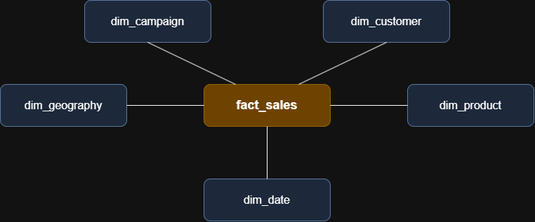

# 📖 Power BI Data Modeling Project

This project walks through turning a messy 23-table dataset into a clean Power BI star schema model that can be used reliably for reporting and analytics.

---
## 🎯 Project Goal
The objective is to transform a complicated dataset containing 23 interconnected tables into a well-structured star schema. This involves identifying business entities, separating facts from dimensions, creating relationships, building measures, and validating the final model.

---
## 🔄 Phases
1. **Prepare & Explore** (Step 1)
2. **Create Dimensions** (Steps 2 – 4)
3. **Create the Facts** (Steps 5 – 8)
4. **Polish** (Steps 9 – 12)

---
## 📜 Rules
1. **Build a Star Schema:** A fact in the middle, dimensions around it.
2. **Understand before making any changes:** Always read the grain first.
3. **Every column earns its place:** If a column doesn’t help the report, drop it.
4. **Protect the numbers:** Be aware of the Totals, re-check after every change.

---
## ⚙️ Standards
* **Language:** English
* **Naming:** `snake_case`
* **Tables (prefix):** `fact_` & `dim_`
* **Keys (suffix):** `_id` (From source) & `_key` (Created by us in PBI)
* **Friendly column names:** `customer_name`, `total_revenue`, `order_status`

---
🏗️ Model Architecture

The model architecture for this project follows Star Schema (Fact table in the middle surrounded by multiple dimensions):



---
## 🛠️ Important Links & Tools:

Everything is for Free!
- **[Datasets](datasets/):** Access to the project dataset (csv files).
- **[Power Bi Desktop](https://www.microsoft.com/en-us/download/details.aspx?id=58494):** Free app from Microsoft to convert data to insight to action using data visualization and analysis.
- **[Power BI Service](https://app.powerbi.com/home?experience=power-bi):** PBI Service (Not Free) Intuitive data visualization, detailed analytics, and interactive dashboards.
- **[Git Repository](https://github.com/):** Set up a GitHub account and repository to manage, version, and collaborate on your code efficiently.
- **[DrawIO](https://www.drawio.com/):** Design data architecture, models, flows, and diagrams.
- **[Notion](https://www.notion.com/):** All-in-one tool for project management and organization.
- **[Notion Project Steps](https://app.notion.com/p/Power-BI-B2B-Data-Modeling-Project-3f4f6b7f331f801b9d2af44af26bb2ad?source=copy_link):** Access to All Project Phases and Tasks.

---
## 📂 Repository Structure
```
b2b-data-modeling-project/
│
├── datasets/                           # Raw datasets used for the project (23 tables)
│
├── docs/                               # Project documentation and architecture details
│   ├── star_schema                     # Draw.io file shows the basic data model structure of the project
│   ├── power_query_process_steps       # Draw.io file shows the project's power query data processing
│   ├── b2b_data_modeling_project.pdf   # Project description and step-by-step documentation of the process
│   ├── initial_data_model.png          # PNG file for the data model from source without any changes
│   ├── final_data_model.png            # PNG file for the data model after all the changes done to the dataset
│
├── data_model_project/                 # pbip version of the project
│   ├── data_model.Report/              # Report definition files
│   ├── data_model.SemanticModel/       # Semantic model (dataset) definition files
│   ├── data_model.pbip                 # Root pointer file (opens the project)
│
├── report_images/                      # Screenshots of the example report for the data model
│   ├── Revenue and Campaigns.png       # Report for the fact_sales_target and fact_campaign_spend tables
│   ├── Sales and Inventory.png         # Report for the fact_sales and fact_inventory tables
|
├── b2b_data_model_project.pbix         # pbix version of the project
├── README.md                           # Project overview and instructions
└── LICENSE                             # License information for the repository
```
---
## 🛡️ License
This project is licensed under the [MIT License are free to use, modify, and share this project with proper attribution.

---
## 🌟 About Me
Hi there! I'm **Noe Fraire Alcala**. I’m an IT professional and passionate Database Enginneer working my way into new tecnologies.
